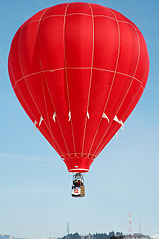
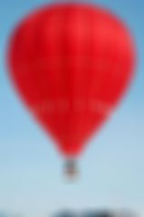

Blur
====

Usage: `blur(radius [, sigma])`

Description
-----------

This filter applies a gaussian blur to the image.

Arguments
---------

-  ``radius`` - Radius used in the gaussian function to generate a matrix,
   maximum value is 150. The bigger the radius more blurred will be the
   image.
-  ``sigma`` - Optional. Defaults to the same value as the radius. Sigma
   used in the gaussian function.

Example
-------

::

    http://localhost:8888/unsafe/filters:blur(7)/http%3A%2F%2Fupload.wikimedia.org%2Fwikipedia%2Fcommons%2Fthumb%2F8%2F8a%2F2006_Ojiya_balloon_festival_011.jpg%2F159px-2006_Ojiya_balloon_festival_011.jpg

