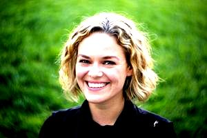

Contrast
========

Usage: `contrast(amount)`

Description
-----------

This filter increases or decreases the image contrast.

Arguments
---------

- ``amount`` - :math:`-100` to :math:`100` - The amount (in %) to change the image contrast. Positive numbers increase contrast and negative numbers decrease contrast.

Example
-------

.. image:: images/tom_before_brightness.jpg
    :alt: Picture before the contrast filter

::

    http://localhost:8888/unsafe/filters:contrast(40)/https%3A%2F%2Fgithub.com%2Fthumbor%2Fthumbor%2Fraw%2Fmaster%2Fexample.jpg

::

    http://localhost:8888/unsafe/filters:contrast(-40)/https%3A%2F%2Fgithub.com%2Fthumbor%2Fthumbor%2Fraw%2Fmaster%2Fexample.jpg

