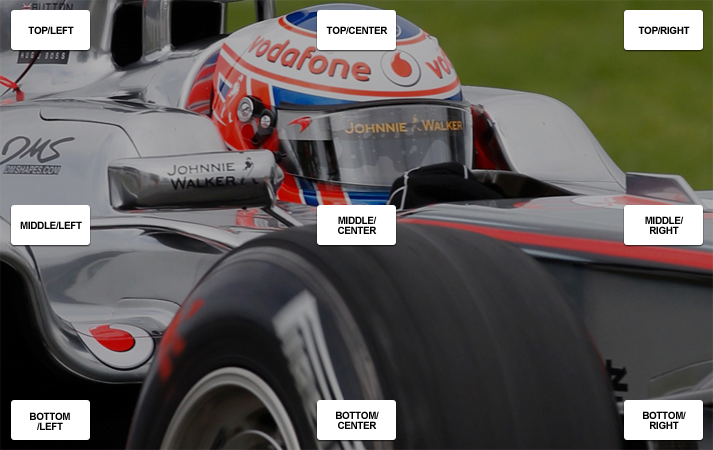

Crop and Resize Algorithms
==========================

.. note::
    thumbor performs the least amount of cropping possible to resize your
    image to the exact size you specified, without changing it's aspect
    ratio.

Cropping the image
~~~~~~~~~~~~~~~~~~

Before resizing the image, thumbor crops it so it has the same aspect as
the desired dimensions. Let's see an example to clarify this concept.

Consider an :math:`800x600` (width x height, in pixels) image and say we want a
:math:`400x150` thumbnail of it. The first thing thumbor needs to do is
calculate the proportion of the images:

.. math::

    width: 800 ÷ 600 = 1.333

.. math::

    height: 400 ÷ 150 = 2.666

Now that they don't match, thumbor defines if the image needs horizontal
or vertical cropping. We never crop both ways, since it's not needed.

So, in our example to get an image of the same proportion of the target
one, we need to get the picture height to be :math:`300px` (using the proportional height):

.. math::

    h = 800 x 150 ÷ 400 = 300

Now all we need to do is cropping :math:`300px` of the picture height. To
determine whether to crop from the top, bottom or both we use the focal
points or the horizontal alignment. If any focal points have been
specified we'll use those to find the center of mass of the image (more
on that in :doc:`detection_algorithms`). Otherwise we'll use the horizontal
and vertical alignments.

Let's say that for this image no focal points were found, so we'll use
the vertical alignment to crop the height. Since we specified middle
alignment for this example, we'll crop off :math:`150px` from the top and :math:`150px`
from the bottom of the image, similarly to this image:

Here's an example of how thumbor would crop width or height using
centered alignment:

Resizing the Image
~~~~~~~~~~~~~~~~~~

Now that the image has the same proportion as the image we want, it's
just a matter of resizing it to the desired dimensions.

Flipping the Image
~~~~~~~~~~~~~~~~~~

If the desired dimensions feature negative numbers, thumbor will flip
them around that direction. This means that negative width specifies
horizontal flip, while negative height specifies vertical flip.
