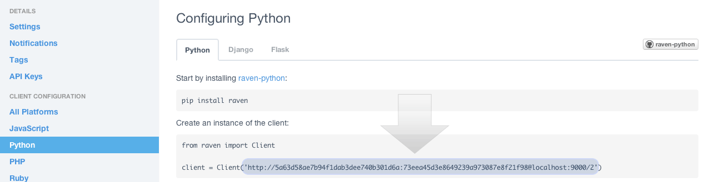

Custom Error Handling
=====================

For many companies it make a lot of sense to have a centralized solution
for handling errors in production, like
`sentry <https://github.com/getsentry/sentry>`__ or
`squash <http://squash.io>`__.

Thumbor must support this type of error handling in order to better
integrate itself to it's users environments.

Enabling Custom Error Handling
------------------------------

Enabling it is as simple as setting the configuration
``USE_CUSTOM_ERROR_HANDLING`` to ``True``.

After that you need to set the custom error handler you want to use with
the ``ERROR_HANDLER_MODULE`` configuration. Please note that this is the
module full name, not the class full name.

Thumbor comes pre-packaged with sentry's custom error handler:
``thumbor.error_handlers.sentry``. If you decide to use it, please read
below on how to configure it.

Sentry - thumbor.error\_handlers.sentry
---------------------------------------

If you choose to use sentry custom error handler, all you need to do is
fill the ``SENTRY_DSN_URL`` configuration with sentry's DSN URL, which
can be found in the admin page for your sentry project, like the one in
the image below:

Writing my own Error Handler
----------------------------

Writing your own error handler is very simple. Just create a class
called ``ErrorHandler``, like the one below:

.. code-block:: python

    class ErrorHandler(object):
        def __init__(self, config):
            # perform any initialization needed
            pass

        def handle_error(self, context, handler, exception):
            # do your thing here
            # context is thumbor's context for the current request
            # handler is tornado's request handler for the current request
            # exception is the error that occurred

When you have your handler done, just put it's full name in thumbor.conf
and make sure thumbor can import it (it's somewhere in PYTHONPATH).
