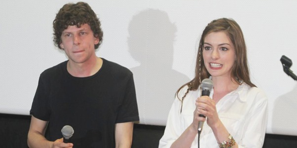
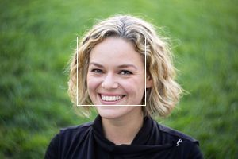
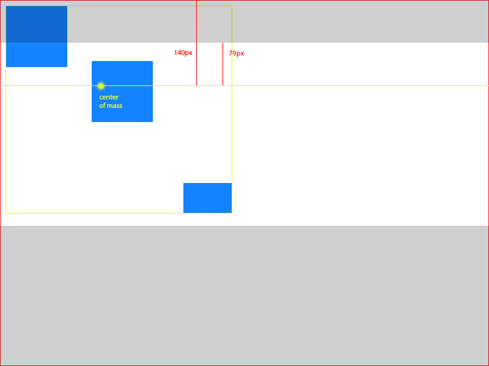
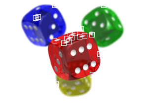

Detection Algorithms
====================

If the smart mode of thumbor has been specified in the uri (by the
/smart portion of it), thumbor will use it's smart detectors to find
focal points.

thumbor comes pre-packaged with two focal-point detection algorithms:
facial and feature. First it tries to identify faces and if it can't
find any, it tries to identify features (more on that below).

Facial Detection
----------------

For instructions on how to get facial detection coordinates see
:ref:`usage-metadata-endpoint` .

thumbor uses OpenCV (http://opencv.org) to detect faces. OpenCV
returns the rectangle coordinates for the faces it identifies. Thumbor
supports changing the file that OpenCV uses for identifying faces. We
can see the algorithm in action below:

Original image

Red rectangles are the areas identified as faces

After retrieving these squares from OpenCV, thumbor calculates the
*center of mass* of the image using *weighted average*.

Consider that OpenCV returned 3 squares at *(10, 10, 100, 100)*, *(150,
100, 100, 100)*, *(300, 300, 80, 50)*, being *(x, y, width, height)*, as
such:

In order to find the *center of mass* for all the faces, we must first
find the center and weight of each rectangle. We define weight in this
scenario as the area of the rectangle.

So, for the faces in our example (***x***,\ ***y*** being the
coordinates of the rectangle's center and ***z*** the rectangle weight):

**Face 1** - (x = (10 + 100) / 2 = 55), (y = (10 + 100) / 2 = 55), (z =
100 \* 100 = 10000)

**Face 2** - (x = (150 + 100) / 2 = 125), (y = (100 + 100) / 2 = 100),
(z = 100 \* 100 = 10000)

**Face 3** - (x = (300 + 80) / 2 = 190), (y = (300 + 50) / 2 = 175), (z
= 80 \* 50 = 4000)

In order to find the *center of mass* we'll do a *weighted average* of
the X and Y coordinates of the faces using:

**Horizontal Axis - X** (((55 \* 10000) + (125 \* 10000) + (190 \*
4000)) / 24000 = 106)

**Vertical Axis - Y** (((55 \* 10000) + (100 \* 10000) + (175 \* 4000))
/ 24000 = 93).

So for the faces found by OpenCV in that image we have the *center of
mass* of the picture being *106x93*.

Using Focal Points for Cropping
~~~~~~~~~~~~~~~~~~~~~~~~~~~~~~~

After finding the center of mass we can use it as the focal point for
cropping. Given an image of *800x600* and a focal point at *106x93*, we
need to determine the percentage that needs to be cropped from the top,
bottom, left and right sides of the image.

To determine the percentage we use simple math to figure how far from
the top and the left side the *center of mass* is:

**From the left** - (106 / 800 \* 100 = 13.25%)

**From the top** - (93 / 600 \* 100 = 15.50%)

Using the same example from the :doc:`crop_and_resize_algorithms` page, we
need to crop *300px* out of the height of the image. In possession of
the percentages of crop above, we can calculate how much we need to crop
out of the top and bottom with:

**Top** - (300 \* 0.155 ~= 46)

**Bottom** - just subtract top (*46px*) from the amount of crop
(*300px*) - (300 - 46 = 254)

So, now we now we have to remove *46px* out of the top of the picture
and *254px* out of the bottom of the picture. In an *800x600* picture,
that means cropping from *(0, 46)* to *(800, 346)*, resulting in an
*800x300px* image.

Assuming we would crop 300px horizontally, the cropping would be:

**Left** - (300 \* 0.135 ~= 40)

**Right** - just subtract left (*40px*) from the amount of crop
(*300px*) - (300 - 40 = 260)

In an image of *800x600*, that means cropping from *(40, 0)* to *(540,
600)*, resulting in a *500x600px* image. This would not be the case for
this image, though.

Feature Detection
-----------------

If no faces are found in the picture, we still try to find important
features in the image, provided by the Good Features to Track Algorithm
in OpenCV (http://bit.ly/evAU95).

According to OpenCV documentation, this algorithm finds *"important"*
corners in the image. It then returns a list of *(x, y)* values.

We can see the detection taking place in the following images:

.. image:: images/feature_detection_original.jpg
    :alt: Original image

The points identified by the good features algorithm:

The cropping based in these features is analogous to the face one,
except that all points have a weight of ***1.0*** and are already their
centers.

Let's consider that we found **3** feature points: *10x15*, *30x40*,
*25x60*. To find the center of mass we would do ((10 + 30 + 25) / 3 ~=
22) to find the horizontal component and ((15 + 40 + 60) / 3 ~= 39) for
the vertical one. This means that our center of mass in this scenario is
***22x39***.

Given an image of *800x600* and a center of mass of *22x39*, let's find
the left and top percentages:

**From the left** - (22 / 800 \* 100 = 2.75%)

**From the top** - (93 / 600 \* 100 = 6.50%)

Assuming we are cropping *300px* of the height, we'll crop top and
bottom according to:

**Top** - (300 \* 0.0275 ~= 9)

**Bottom** - just subtract top (*9px*) from the amount of crop (*300px*)
- (300 - 9 = 291)

In an image of *800x600*, that means cropping from *(0, 9)* to *(800,
309)*, resulting in a *800x300px* image.

If we were cropping *300px* of the width instead, we would crop left and
right according to:

**Left** - (300 \* 0.065 ~= 20)

**Right** - just subtract left (*20px*) from the amount of crop
(*300px*) - (300 - 20 = 280)

In an image of *800x600*, that means cropping from *(20, 0)* to *(520,
600)*, resulting in a *500x600px* image.
