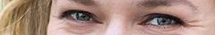
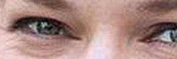

Extract focal points
====================

Usage: `extract_focal()`

Description
-----------

When cropping, thumbor uses focal points in the image to direct the area
of the image that matters most. There are several ways of finding focal
points. To learn more about focal points, visit the :doc:`detection_algorithms`.

In order to use the ``extract_focal`` filter, the original image must be
a thumbor URL that features manual cropping. To learn more about manual
cropping, visit the :doc:`crop_and_resize_algorithms`.

Using the original manual cropping points, this filter adds the cropped
area (originally in the format `/LEFTxTOP:RIGHTxBOTTOM/`) as a focal point
for the new image.

For the new image, thumbor will use as the original the image URL that
was the original for the segment with the manual cropping.

This means that for an URL like:

::

    http://localhost:8888/unsafe/300x100/filters:extract_focal()/localhost:8888/unsafe/240x220:480x260/https%3A%2F%2Fgithub.com%2Fthumbor%2Fthumbor%2Fraw%2Fmaster%2Fexample.jpg

Thumbor will use as original the following image URL:

::

    https://github.com/thumbor/thumbor/raw/master/example.jpg

Example
-------

Original Image:

.. image:: images/tom_before_brightness.jpg

Eye cropped:

::

    http://localhost:8888/unsafe/240x220:480x260/https%3A%2F%2Fgithub.com%2Fthumbor%2Fthumbor%2Fraw%2Fmaster%2Fexample.jpg

A bigger image based on above's crop with the extract\_focal() filter:

::

    http://localhost:8888/unsafe/300x100/filters:extract_focal()/localhost:8888/unsafe/240x220:480x260/https%3A%2F%2Fgithub.com%2Fthumbor%2Fthumbor%2Fraw%2Fmaster%2Fexample.jpg

Without the filter that would be the result:

::

    http://localhost:8888/unsafe/300x100/localhost:8888/unsafe/240x220:480x260/https%3A%2F%2Fgithub.com%2Fthumbor%2Fthumbor%2Fraw%2Fmaster%2Fexample.jpg

