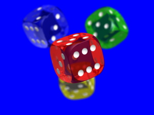
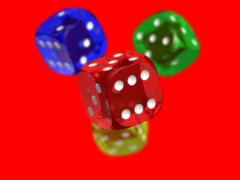
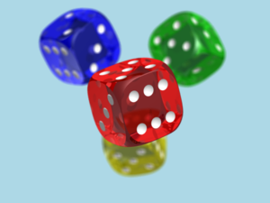
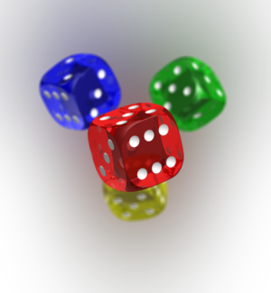

Filling
=======

Usage: `fill(color[,fill_transparent])`

Description
-----------

This filter returns an image sized exactly as requested
independently of its ratio. It will fill the missing area with the specified color.
It is usually combined with the "fit-in" or "adaptive-fit-in" options.

Arguments
---------

-  ``color`` - the color name (like in HTML) or hexadecimal RGB expression
   without the "#" character (see
   `<https://en.wikipedia.org/wiki/Web_colors>`_ for example).

   If color is "transparent" and the image format, supports transparency the
   filling color is transparent.

   .. warning::

      Some engines (like OpenCV engine) do not support transparency.

   If color is "auto", a color is smartly chosen (based on the image pixels)
   as the filling color.

   If color is "blur", the missing parts are filled with blurred original image.

-  ``fill_transparent`` - a boolean to specify whether transparent areas of the
   image should be filled or not. Accepted values are either `true`, `false`,
   `1` or `0`. This argument is optional and the default value is `false`.

Example #1
----------

The original image is:

::

    http://localhost:8888/unsafe/fit-in/300x300/filters:fill(blue)/https%3A%2F%2Fgithub.com%2Fthumbor%2Fthumbor%2Fraw%2Fmaster%2Fexample.jpg

::

    http://localhost:8888/unsafe/fit-in/300x300/filters:fill(f00)/https%3A%2F%2Fgithub.com%2Fthumbor%2Fthumbor%2Fraw%2Fmaster%2Fexample.jpg

::

    http://localhost:8888/unsafe/fit-in/300x300/filters:fill(add8e6)/https%3A%2F%2Fgithub.com%2Fthumbor%2Fthumbor%2Fraw%2Fmaster%2Fexample.jpg

::

    http://localhost:8888/unsafe/fit-in/300x300/filters:fill(auto)/https%3A%2F%2Fgithub.com%2Fthumbor%2Fthumbor%2Fraw%2Fmaster%2Fexample.jpg

::

    http://localhost:8888/unsafe/fit-in/300x300/filters:fill(blur)/https%3A%2F%2Fgithub.com%2Fthumbor%2Fthumbor%2Fraw%2Fmaster%2Fexample.jpg

Example #2
----------

The original image is:

.. image:: images/dice_transparent_background.png
    :alt: Original picture

::

    http://localhost:8888/unsafe/fit-in/300x225/filters:fill(blue,1)/https://github.com/thumbor/thumbor/wiki/dice_transparent_background.png

::

    http://localhost:8888/unsafe/fit-in/300x225/filters:fill(f00,true)/https://github.com/thumbor/thumbor/wiki/dice_transparent_background.png

::

    http://localhost:8888/unsafe/fit-in/300x225/filters:fill(add8e6,1)/https://github.com/thumbor/thumbor/wiki/dice_transparent_background.png

::

    http://localhost:8888/unsafe/fit-in/300x225/filters:fill(auto,true)/https://github.com/thumbor/thumbor/wiki/dice_transparent_background.png

.. image:: images/dice_auto_background.png
    :alt: Picture after the fill(auto) filter (since 3.7.1)

::

    http://localhost:8888/unsafe/fit-in/300x225/filters:fill(blur,true)/https://github.com/thumbor/thumbor/wiki/dice_transparent_background.png

