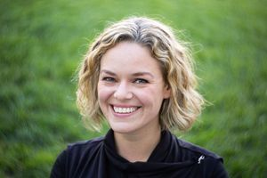

Proportion
==========

Usage: `proportion(percentage)`

Description
-----------

This filter applies the specified proportion to the image's height and width when cropping.

Arguments
---------

-  ``percentage`` - The float percentage of the proportion (0.0 to 1.0).

Example
-------

::

    http://localhost:8888/unsafe/filters:proportion(0.5)/https%3A%2F%2Fgithub.com%2Fthumbor%2Fthumbor%2Fraw%2Fmaster%2Fexample.jpg

