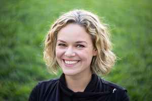

Quality
=======

Usage: `quality(amount)`

Description
-----------

This filter changes the overall quality of the JPEG image (does nothing
for PNGs or GIFs).

Arguments
---------

- ``amount`` - ``0 to 100`` - The quality level (in %) that the end image will
feature.

Example
-------

.. image:: images/tom_before_brightness.jpg
    :alt: Picture before the quality filter

::

    http://localhost:8888/unsafe/filters:quality(40)/https%3A%2F%2Fgithub.com%2Fthumbor%2Fthumbor%2Fraw%2Fmaster%2Fexample.jpg

