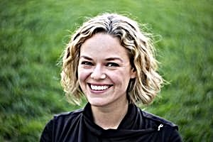

Sharpen
=======

Usage: `sharpen(sharpen\_amount,sharpen\_radius,luminance\_only)`

Description
-----------

This filter enhances apparent sharpness of the image. It's heavily based
on Marco Rossini's excellent Wavelet sharpen GIMP plugin. Check
`<http://registry.gimp.org/node/9836>`_ for details about how it work.

Arguments
---------

-  ``sharpen_amount`` - Sharpen amount. Typical values are between :math:`0.0` and
   :math:`10.0`.
-  ``sharpen_radius`` - Sharpen radius. Typical values are between :math:`0.0` and
   :math:`2.0`.
-  ``luminance_only`` - Sharpen only luminance channel. Values can be
   ``true`` or ``false``.

Example 1
---------

.. image:: images/tom_before_brightness.jpg
    :alt: Picture before the sharpen filter

::

    http://localhost:8888/unsafe/filters:sharpen(2,1.0,true)/https%3A%2F%2Fgithub.com%2Fthumbor%2Fthumbor%2Fraw%2Fmaster%2Fexample.jpg

