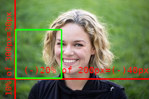
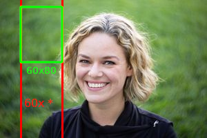
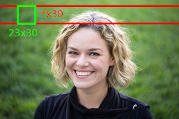
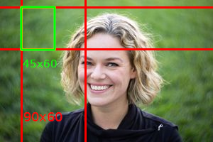

Watermark
=========

Usage: `watermark(imageUrl, x, y, alpha [, w_ratio [, h_ratio]])`

Description
-----------

This filter adds a watermark to the image. It can be positioned inside the image
with the alpha channel specified and optionally resized based on the image size by
specifying the ratio (see Resizing_).

Arguments
---------

-  ``imageUrl`` - Watermark image URL. It is very important to understand
   that the same image loader that Thumbor uses will be used here. If
   this URL contains parentheses they MUST be url encoded, since these
   are the characters Thumbor uses as delimiters for filter parameters.
-  ``x`` - Horizontal position that the watermark will be in. Positive
   numbers indicate position from the left and negative numbers indicate
   position from the right.
   If the value is 'center' (without the single quotes), the watermark will be centered horizontally.
   If the value is 'repeat' (without the single quotes), the watermark will be repeated horizontally.
   If the value is a positive or negative number followed by a 'p' (ex. 20p) it will calculate the value
   from the image width as percentage
-  ``y`` - Vertical position that the watermark will be in. Positive numbers
   indicate position from the top and negative numbers indicate position
   from the bottom.
   If the value is 'center' (without the single quotes), the watermark will be centered vertically.
   If the value is 'repeat' (without the single quotes), the watermark will be repeated vertically
   If the value is a positive or negative number followed by a 'p' (ex. 20p) it will calculate the value
   from the image height as percentage
-  ``alpha`` - Watermark image transparency. Should be a number between 0
   (fully opaque) and 100 (fully transparent).
-  ``w_ratio`` - percentage of the width of the image the watermark should fit-in, defaults to 'none'
   (without the single quotes) which means it won't be limited in the width on resizing but also won't
   be resized based on this value
-  ``h_ratio`` - percentage of the height of the image the watermark should fit-in, defaults to 'none'
   (without the single quotes) which means it won't be limited in the height on resizing but also won't
   be resized based on this value

Example
-------

::

    http://thumbor-server/filters:watermark(http://my.site.com/img.png,-10,-10,50)/some/image.jpg

|watermark|

::

    http://thumbor-server/filters:watermark(http://my.site.com/img.png,10p,-20p,50)/some/image.jpg

|watermark_relative|

Resizing
--------

Resizing is being done by defining borders the watermark needs to fit in or being upscaled to.
The ratio of the watermark will not be changed and will be expanded or shrinked to the size which
fits best into the borders.

Some examples are shown below with an original image having width=300 and height=200 and an imaginary
watermark having width=30 and height=40. Borders are shown in red and the watermark drafted in green.

Considering original image to be 300x200:

- **watermark(imageUrl, 30, 10, 50, 20)**

  20% of the *width*: 300px*0.2 = 60px so the original watermark *width* is 30px which means it
  can be resized by 2.

  Because the *height* isn't limited it can grow to 2x40px which is 80px.

  |watermark_resized_width|

- **watermark(imageUrl, 30, 10, 50, none, 15)**

  15% of the *height*: 200px*0.15 = 30px so the original watermark *height* is 40px which means
  it has to shrink by 25%.

  Because the *width* isn't limited it can shrink to 0.75*30px which is 22.5px (rounded to 23px).

  |watermark_resized_none_height|

- **watermark(imageUrl, 30, 10, 50, 30, 30)**

  30% of the *width*: 300px*0.3 = 90px

  and

  30% of the *height*: 200px*0.3 = 60px

  so the original watermark *width* is 30px but cannot use 90px because then (to keep
  the ratio) the *height* would need to become (40/30)*90px=120px but only 60px is allowed.

  Therefor the *height* is limiting the resizing here and *height* would become 60px and *width*
  would be (30/40)*60px=45px which fits into the 90px border.

  |watermark_resized_width_height|

.. |original| image:: images/tom_before_brightness.jpg
    :alt: Picture before the watermark filter

